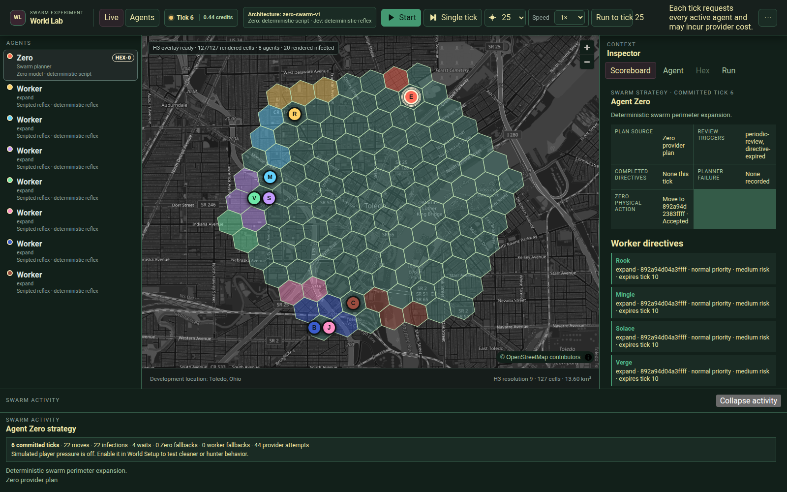
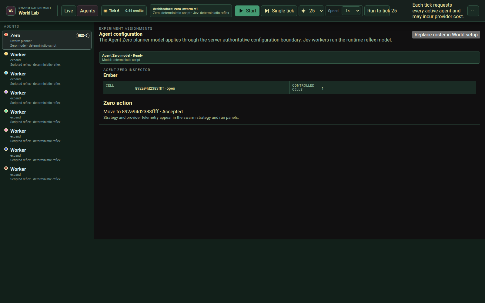

# Hex Zero

[](https://github.com/BlackSwampAI/hexzero/actions/workflows/ci.yml)
[](.nvmrc)
[](package.json)

Hex Zero is an agent-first geographic experiment. Agent Zero plans territory
expansion on a real H3 map, and TypeSafe Jev workers resolve those directives
into movement, infection, capture, or wait. The World Lab is the developer/admin
surface for configuring runs and inspecting safe decisions, territory, and
provider usage. Every agent is visible.



## How it works

`zero-swarm-v1` is the sole cognition architecture:

1. **Agent Zero plans through OpenRouter** on the first tick, periodic review,
   or a material change such as directive completion, expiry, or player pressure.
   The server compiles bounded semantic strategic options per worker, and Agent
   Zero selects an opaque option ID for each; the request carries no raw H3 cell
   or agent IDs. Other ticks reuse the current directives without a planner call.
2. **Workers resolve directives through TypeSafe Jev** using compact observations
   and opaque, engine-legal action candidates. Workers share a frozen pre-action
   world; their calls currently run sequentially under one tick deadline.
3. **The deterministic world engine validates and resolves actions** in seeded
   order. A complete tick commits atomically; cancellation commits no world
   changes. Provider failures retain safe attempt records and use explicit
   deterministic fallbacks.

Cells are `open` or `infected`, and each infected cell has one controller.
Movement leaves infection behind. Capture transfers an abandoned infected
current cell from another controller. There is no agent chat, diplomacy,
personality configuration, per-worker goal state, or prose memory.

The deterministic-worker variant exists only as an ablation control for the
comparison CLIs. It is not a second production architecture.

## Run locally

Use **Node.js 24.18.0** and **pnpm 11.21.0**, pinned in the repository.

```bash
corepack enable
pnpm install --frozen-lockfile
cp .env.example .env
# Set OPENROUTER_API_KEY and TYPESAFE_API_KEY in the root .env.
pnpm dev
```

Open <http://localhost:3000>. The Game API binds to
<http://127.0.0.1:8787>; Next.js proxies `/api/game/*` to it. Select a compatible
Agent Zero model in **Agents**, then use **Single tick** or **Start**. Jev's
worker model is pinned server-side. Both provider keys are required for genuine
runs; keys never belong in browser environment variables.

For a deterministic walkthrough without provider keys or paid calls:

```bash
pnpm dev:test-provider
```

Scripted mode bypasses `.env` loading and uses local deterministic providers.
The basemap still loads external OpenStreetMap tiles; explicit location search uses
Nominatim. Neither is needed by the offline unit tests.

The basemap uses OpenStreetMap's standard raster tiles without a key. MapLibre
applies a dark grayscale treatment to that layer while preserving agent and
territory colors. Requests use normal browser caching and referrer behavior;
there is no tile prefetch or offline map download. Follow the
[OpenStreetMap tile usage policy](https://operations.osmfoundation.org/policies/tiles/)
when deploying or extending the map.



These screenshots show the current interface in scripted mode. Capture details
are in [the screenshot guide](docs/assets/README.md).

## World Lab

- **World Setup:** preview and apply H3 resolutions 8–11, 1–32 agents, and up
  to 5,000 generated cells. The default is a 127-cell disk around Toledo, Ohio,
  with eight perimeter starts. Optional seeded player pressure uses
  `casual-cleaner` or `trail-hunter-v1`.
- **Bounded execution:** run to absolute tick targets of 5, 10, 25, 50, or 100,
  cancel an active tick, or reset the scenario. Playback pauses at the target
  or full infection. There is no background scheduler.
- **Inspection:** switch between Live and Agents while the same execution
  controller stays mounted. Inspect Zero strategy, worker directives, reflex
  choices, validation outcomes, territory, and safe activity records.
- **Research exports:** generate compact or pretty schema-v13 JSON, download
  it, or manually save the exact generated artifact to local SQLite. Exports
  include bounded safe tick and provider-attempt records, including attempts
  that did not produce a committed tick.

Live world state and active run telemetry are process-local. Restarting the
Game API loses the active run; the SQLite archive stores exported research
artifacts and cannot resume a simulation.

## Provider costs and trust

A genuine tick normally makes one Jev request per active worker and an
OpenRouter planning request only when replanning is required. A planner call
may make at most one transient retry within the original deadline.
OpenRouter cost is shown only when reported; TypeSafe monetary cost remains
unknown. World Setup's attempt and credit-admission limits are operator
safeguards, not upstream billing guarantees.

The local API has no authentication or provider-account balance enforcement.
Keep it on loopback; it is not suitable for unauthenticated public deployment.
Provider credentials stay behind the agent runtime. Exports and archives omit
raw provider payloads, fixed prompts, credentials, and private reasoning.
See [Security](docs/SECURITY.md).

## Workspace

| Path                          | Responsibility                                                  |
| ----------------------------- | --------------------------------------------------------------- |
| `apps/world-lab`              | Next.js developer/admin map and operator controls               |
| `apps/game-api`               | Hono HTTP boundary and in-memory simulation orchestration       |
| `packages/world-engine`       | Pure deterministic world validation and consequence application |
| `packages/agent-runtime`      | OpenRouter planner, TypeSafe Jev adapter, and model catalog     |
| `packages/shared`             | Runtime-validated boundary schemas and inferred types           |
| `packages/experiment-archive` | SQLite imports and bounded research queries                     |

## Validation and research

Default tests and GitHub CI are deterministic and make no model-provider calls.
The repository owner runs local validation before a branch is pushed or a
draft PR is opened:

```bash
pnpm install --frozen-lockfile
pnpm validate
pnpm exec playwright install chromium # first run only
pnpm test:e2e
```

`pnpm validate` checks formatting, lint, types, unit/component tests, and builds.
Playwright starts scripted application servers separately. See
[Testing](docs/TESTING.md) for coverage and the owner validation workflow.

| Command                | Purpose                                                      |
| ---------------------- | ------------------------------------------------------------ |
| `pnpm compare:offline` | Reproducible Jev-fixture versus deterministic comparison     |
| `pnpm compare:live`    | Paid comparison; explicit acknowledgement and model required |
| `pnpm diagnose:swarm`  | Summarize a running local API without provider calls         |
| `pnpm experiment:db`   | Import and query safe exports in the local archive           |

The **Test Agent Zero planner** button is also an explicit paid, non-mutating
probe. Neither that probe nor `compare:live` runs in default tests or CI.

## Documentation

- [Architecture](docs/ARCHITECTURE.md) — tick flow, boundaries, and HTTP endpoints
- [Testing](docs/TESTING.md) — coverage and exact validation commands
- [Security](docs/SECURITY.md) — secrets, prompts, telemetry, and deployment limits
- [Experiment archive](docs/EXPERIMENT_ARCHIVE.md) — SQLite import and queries
- [Offline comparison](docs/ZERO_SWARM_COMPARISON.md) and
  [live comparison](docs/LIVE_SWARM_COMPARISON.md) — methodology and evidence limits
- [Roadmap](ROADMAP.md) and [Gameplay Foundation](docs/GAMEPLAY_FOUNDATION.md) —
  delivered behavior and future product scope
- [ADR 0033](docs/adr/0033-retire-legacy-multi-agent-architecture.md) — retirement
  of the previous architecture

Current code reads only schema-v13 exports. Pre-swarm scenarios, snapshots, and
exports require an older Git revision. Historical ADRs and experiment reports
remain as decision history.

Hex Zero was formerly named Agentborne. Deprecated `AGENTBORNE_PROVIDER` and
`AGENTBORNE_EXPERIMENT_DB` aliases remain supported; corresponding `HEXZERO_`
settings take precedence. Existing `.agentborne` archive paths and browser
preferences retain the documented rename compatibility. See
[archive path migration](docs/EXPERIMENT_ARCHIVE.md).
